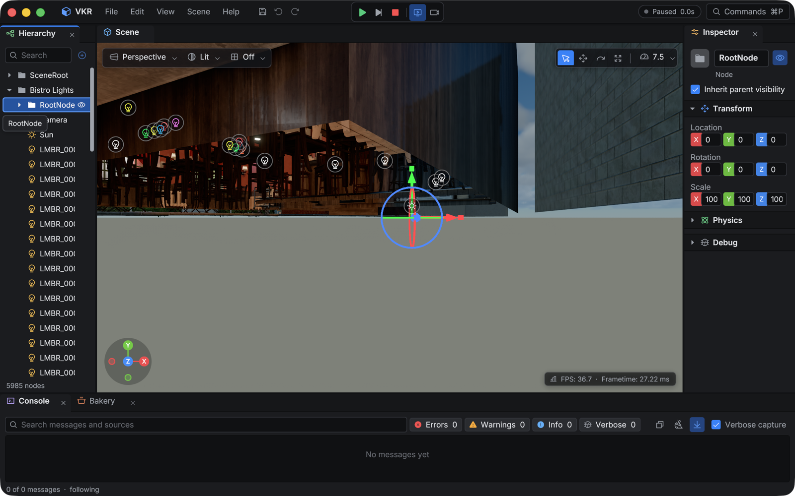
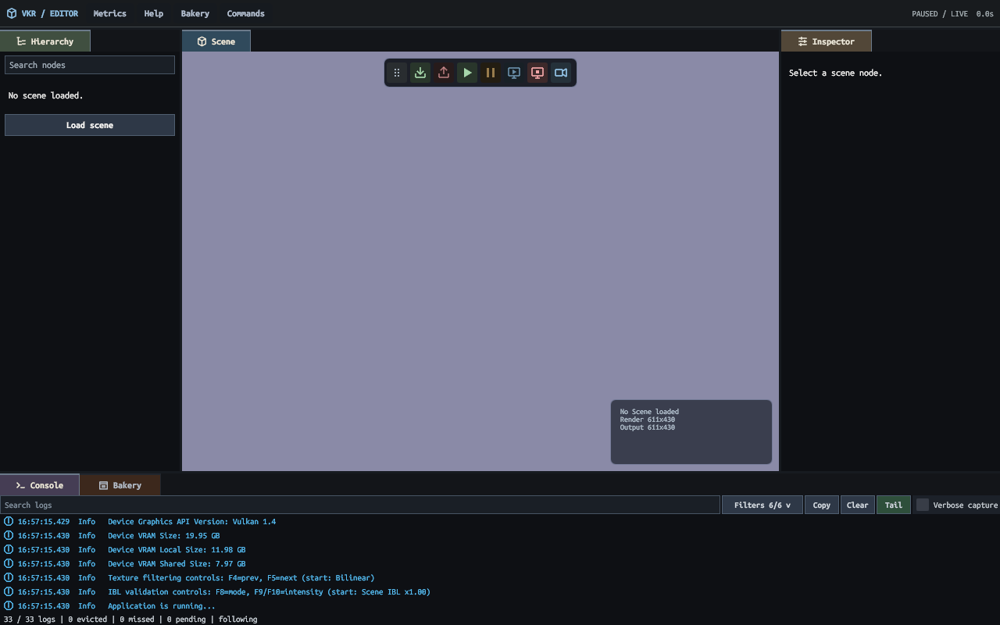
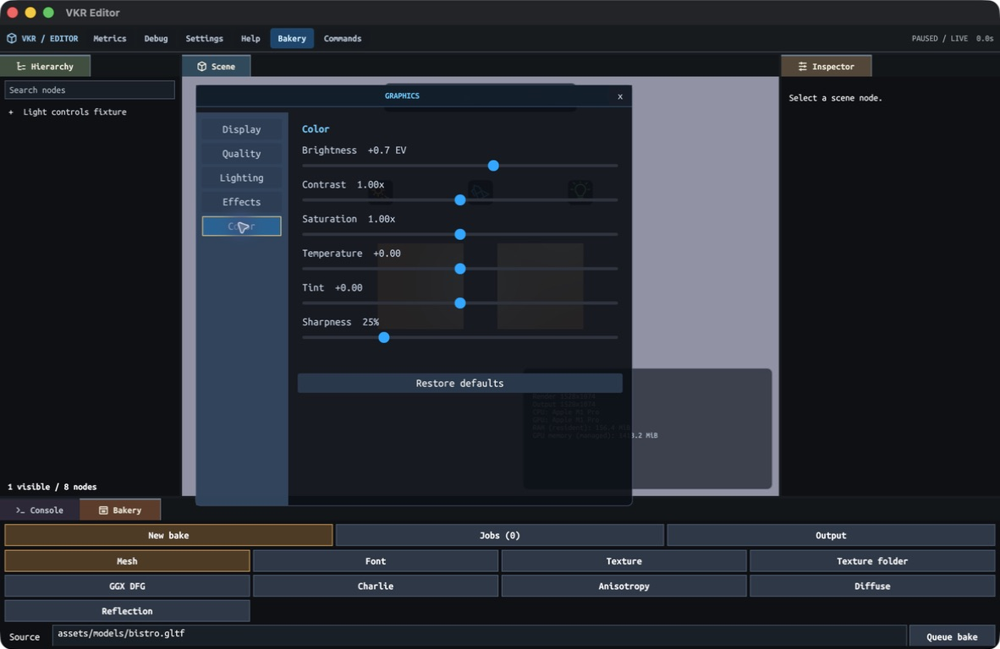
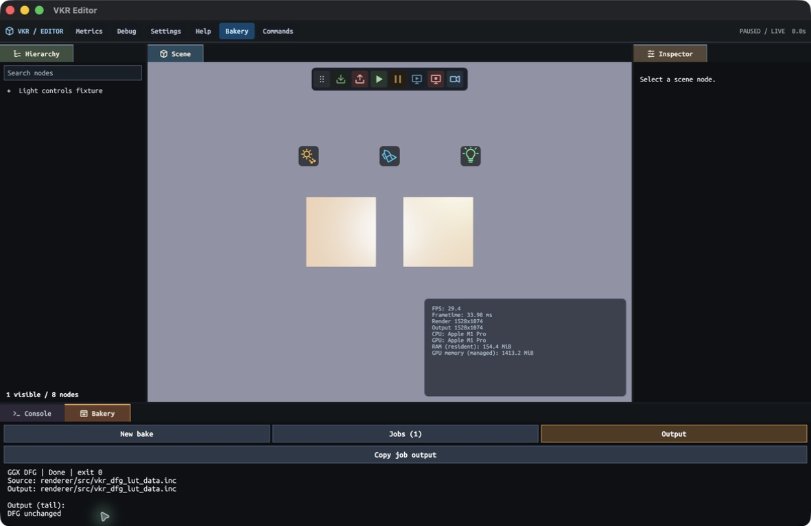

# ADR-027: Immediate-mode grid UI with retained CPU state

## Status

Accepted.

## Context

The app and editor need stable widget interaction, docked panels, text editing,
and native-resolution overlay drawing without a second renderer-owned UI scene.

## Decision

Callers build UI each frame through an immediate-mode API. The UI system retains
state by stable widget ID, including interaction, text editing, scroll offsets,
last layout, and reusable draw storage. Layout uses grid tracks only. Input
hit-testing uses the previous frame's retained rectangles.

`vkr_ui_end()` completes focus, input capture and tooltip text borrowing.
Layout, hashes, damage and draw geometry resolve once in
`vkr_ui_system_prepare_draw_list()`. Before that resolution, the runtime's
projection callback can update current-frame widget rectangles by stable ID.
The editor uses this boundary to keep light icons on the same unjittered camera
pose and Scene rectangle as the submitted packet, including camera motion and
dock resizing. Rectangle changes after preparation are rejected.

The system lowers the complete visual tree to ordered, scissored batches of
vertices and indices. When the tree, target, and scale are unchanged, it reuses
retained CPU geometry; each frame still uploads and draws that stream. Tile
hashes expose changed regions but do not imply a cached GPU target.

The dock tree is bounded, validated, and persisted as JSON. Its scene panel
rectangle drives editor viewport mapping. UI is composited after Scene output
at the drawable's native extent. In-window leaves support compact tab stacks,
reordering, edge splits, and resizing. Drawing, tab hit-testing, and drop insertion
share dock geometry; stable tab IDs survive moves. Recursive subtree minima
preserve 96-point panel width and 64-point content height when the window fits;
smaller windows divide the shortage proportionally. The editor saves its layout to
`.vkr-editor-layout.json` unless `VKR_EDITOR_LAYOUT_PATH` overrides or disables it.

App and editor performance widgets show FPS/frame time, render/output extents,
CPU/GPU models, process resident RAM and managed GPU memory. The neutral
sample runtime copies hardware identity at startup and refreshes memory text
once per second in fixed owned buffers. UI callbacks borrow those strings only
through build. RAM uses the OS resident/working-set count, including shared
mappings; GPU memory uses Metal's managed budget charge (heaps, external resources and
transfer rings) or Vulkan's renderer-owned committed allocations, prefixed with
`~` when totals are approximate. Device-wide Vulkan heap usage is not process
consumption. These counters can overlap on unified memory and are not
additive. Unavailable queries display unavailable. App output is the native
presentation extent; editor output is the Scene image extent.

App debug panels use content-derived dimensions instead of fixed minima. Text
line bounds, row gaps, padding and borders determine their size. The performance
block receives its wrapping width before measurement, capped by the panel's
380-point maximum and the available window width.

Editor tabs use category-colored vector icons and an amber focused border. Real
Ubuntu Mono Bold supplies headings; vector controls keep the existing UI vertex
ABI. Icon strokes and fills use inner/outer convex polygon rings with a
one-physical-pixel alpha transition centered on each edge. Shared CPU lowering
emits opaque inner and transparent outer vertices; both backends interpolate
coverage through their existing linear-alpha blending. Capacity checks admit
complete polygons, including their fringe, and tile bounds include the outer ring.
Scene load/unload, simulation, rendering and camera controls are icon-only
with tooltips in a floating Scene toolbar. Its grip supports dragging; releasing
near a viewport edge anchors that edge, and resize clamps the toolbar inside the
Scene. Narrow panes wrap the controls. Floating windows and popups have input
priority above the toolbar.
Inspector, Console and Bakery use bordered field surfaces and bold action
buttons; read-only fields, disabled actions, severity and follow-tail states
retain distinct styling.

Enabled visible controls support Tab/Shift-Tab focus and Enter/Space activation.
An unobstructed Scene click clears widget focus and gives Tab to free-camera
capture. Clicking a panel or control restores Tab/Shift-Tab widget navigation.
F3 and the toolbar camera button also enter camera mode; Escape releases capture.
Stopped or hidden Scene views do not accept camera entry.
Holding right mouse over an unobstructed live Scene captures the free camera
until release; focus loss synthesizes the right-button release. This temporary
capture has separate state from Tab/F3/toolbar toggles. Camera capture clears
widget focus and consumes editor input even when its virtual pointer crosses
an overlay. The capture-entry frame consumes no mouse motion.
Window input retains press/release edges, button press positions and press-time
shortcut modifiers until frame completion. Docking consumes final movement before
releasing its drag, including a complete gesture received in one event drain.
The input module selects the platform shortcut modifier for all callers.
Scroll containers capture hover and wheel input while child controls own clicks.
Tab also focuses scroll containers: Page Up/Down moves one viewport and Home/End
moves to the declared bounds. Tab then reaches the visible child controls. A
focused container keeps its border visible without moving its children's layout.
Keyboard scope follows floating input layers, including popups. Text fields
support UTF-8 clipboard input, mouse and keyboard selection, Cmd/Ctrl A/C/X/V,
read-only selection, and caret scrolling. Text drags retain their press anchor
through the final movement; keyboard editing ends the prior mouse selection.
The controls do not provide a native
VoiceOver or Windows UI Automation tree.

Hierarchy caches scene structure and expanded/search-matching rows when their
inputs change, then emits only its visible window. Display slots are bounded;
selection uses generation-bearing entity IDs rather than row positions. Inspector
borrows selected component values and sends a typed edit request after validation.
It edits name, visibility, local TRS and light values. Apply commits a transaction;
Revert/Escape discards the field draft. Authored shear matrices remain read-only.
Runtime selection is shared with viewport picking, and frame selection fits the
selected subtree's mesh bounds.

Debug > Labels expands a master visibility checkbox and directional, spot and
point light checkboxes. Type choices survive the master switch. Actual ECS
components determine the label type, including imported glTF light nodes;
Bistro's punctual lights are points. The editor loads a three-symbol bitmap
font atlas once and releases its font reference at shutdown. The existing font
system retains atlas storage until UI text borrowers are destroyed. No new
shader, UI vertex contract or Scene render target is required.

Light labels are 32-point texture buttons above the entity origin, composited
at native UI resolution, outside lighting and temporal history. They are visible
through scene geometry, clipped to the displayed Scene image, hidden behind the
camera and while Scene rendering is stopped. Disabled lights remain selectable
with gray icons. Clicking an icon selects its entity in Hierarchy and Inspector;
selected icons have an amber border. Frame-scratch anchor records retain entity
IDs, never component pointers, and are discarded on the next UI build. A scene
generation change prevents their use after unload/reload. Labels reserve 96
nodes for subsequent editor controls within the shared 1024-node UI capacity;
capacity exhaustion emits a Console warning and keeps those controls reachable.
Overlapping button presses give ownership to the last drawn button. Slider
release consumes its final pointer position, including a click whose press and
release arrive together.

Inspector distinguishes directional, spot and point lights. Light enabled,
linear RGB, intensity and punctual range use the existing Apply/Revert journal.
Directional and spot directions have local yaw/elevation fields and sliders;
node rotation still transforms that local direction. Spots add inner/outer
half-angle fields and sliders in degrees. Edited cones require an ordered,
distinguishable cosine interval for smooth attenuation. Unedited authored values
retain their exact representation. These controls use existing undo/redo and
sidecar persistence.

The [light-controls screenshot](../../assets/editor/light-label-controls.png)
comes from a normal Release Metal run of
[`editor_lights.scene.json`](../../assets/scenes/fixtures/editor_lights.scene.json).
`./build_editor.sh Release`, `./build_release.sh`, and `./build_test.sh` pass.
Native UI checks cover all three light types, master/type switches, icon
selection, direction sliders and Apply/Undo/Redo, light enable, invalid cones,
F3/Escape capture and Stop/Resume. A bounded Bistro run also selects imported
point lights from their labels. CPU checks cover deferred rectangle placement,
retained hit bounds, overlapping-button ownership and final slider positions.
The computer-use interface cannot hold right mouse across movement; sustained
RMB gestures and focus-loss release remain unverified natively. Windows/Vulkan
execution is unavailable on this host. No performance comparison is claimed.

Graphics Settings CPU oracles pass two round trips, twenty invalid/default and
dependency cases, restart/live classification, and missing-file handling. The
process-group cancellation oracle passes. The Release and Debug wrappers pass
without cooking log entries; a third `./build_editor.sh Release` pass also
passes. SHA-256 values for all four shared tables remain unchanged. A native
macOS Graphics check on `editor_lights.scene.json` exits 0 and covers the
Graphics menu as the sole item, all five left tabs, the right pane, live
Bloom-off, shadows-off, SSR-off, SSGI-on, fog-off, depth-of-field and motion-blur
enablement, brightness change, persisted values, Restore defaults, and the
display Vsync restart notice. Bakery UI coverage also exits 0: the GGX recipe
reports `Done`, exit 0, and `DFG unchanged`; cancelling a running anisotropy job
reports `Cancelled`, exit 143, and leaves no cooker descendants in `pgrep`.
Final UI opacity coverage passes. Windows UI/process-tree behavior and native
Vulkan execution remain unverified.

The direct table-publication CPU check passes atomic full replacement, preserves
the destination marker after a failed replacement, rejects a missing parent, and
leaves no temporary files after handled failures. The latest `./build_release.sh`
run passes against the current source; its evidence log is
`.scratch/renderer-delivery-release-final-build.log`. The four shared-table
hashes remain unchanged after these checks.

Commands (Cmd/Ctrl+P) searches scene, layout, panel and transport actions.
Pointer hover selects a visibly highlighted result; click or Enter runs it.
Held Up/Down repeats after 350 ms at 55 ms intervals, keeping the selected
result visible; the wheel scrolls the list independently. Hover takes precedence
over focus when choosing a tooltip, and the search field has no obscuring hint.
Navbar buttons toggle their open dropdown, window or active Bakery tab closed;
an inactive Bakery tab is selected. The navbar remains reachable while Commands
owns input below it.

The Scene resolution badge also shows the runtime's averaged frame cadence
(FPS and wall-clock frametime, including the editor loop), replacing timing with
stopped/unloaded state when Scene rendering is inactive. These are not isolated
GPU pass timings.

The
editor accepts a project-relative `--scene <scene.json>` or `VKR_SCENE_PATH`;
the default remains
Bistro. Cmd/Ctrl+S saves committed edits, and Cmd/Ctrl+Z / Shift+Z undo/redo
when a text field does not own keyboard editing.

The runtime owns 128 undo entries and releases them on scene replacement. A whole
gizmo drag becomes one entry before selection or transport actions can end it. Explicit Save writes `<scene>.editor.json` atomically,
using source entity/node identities and fingerprints. Loading validates complete
JSON, resolves every source identity and stages names before mutation. A conflict
leaves the source scene unchanged and prevents overwriting the conflicting file.
Rejection diagnostics distinguish malformed files, unavailable sources, duplicate
identities, changed fingerprints, incompatible fields, and staging failures. A
fingerprint conflict reports the record, source identity, and saved/current hashes.
Original glTF and scene JSON files are not rewritten. Reload/unload refuses unsaved
committed edits. These sidecars are applied by the shared interactive app/editor
runtime; harness scene loads do not implicitly consume editor overrides.

Console keeps 2,048 structured records with stable sequences, severity, source,
UTC time and bounded message text. Producers append under the existing logger
mutex; the UI copies at most 256 new records per build. Each history ring uses
4,653,056 bytes, with one logger ring and one editor snapshot ring. Eviction,
truncation and lag remain visible. Text/source search, severity filters, follow-tail,
record/range copying and read-only detail selection operate on copied data.
Rows pair distinct CPU vector severity icons with red/coral, amber, blue, violet
and green text; text labels preserve severity without relying on color.
Severity filters live in one dropdown with independent colored checkboxes and an
enabled-count label. Its keyboard navigation and pointer handling do not activate
the covered log rows.
Editor builds compile all log levels; capture defaults to INFO, and Verbose capture
enables DEBUG/TRACE before formatting. App builds retain their existing compile
policy and do not allocate the editor logger ring.

Bakery queues nine recipes—mesh, font, single texture, texture directory, GGX
DFG, Charlie, anisotropy, diffuse volume, and reflection probe—on one worker.
The worker launches one cancellable child with explicit arguments, writes no
renderer state, terminates the complete child process tree on cancellation, and
publishes completion before the UI reads results. Shutdown cancels and joins the
worker. New bake separates mesh, font, single texture and texture-directory
sources, retaining each source draft when the type changes. Jobs shows textual
status, selection, cancellation and retry; Output shows a wrapped 4 KiB display
tail and copies up to 16 KiB of captured status/output. Controls stack in narrow
docks. Mesh jobs accept `.obj`, `.gltf` and `.glb`, always rebuild, and replace
the source extension with `.vkb`. Font and texture cookers own incremental
checks; their Rebuild option bypasses unchanged-output skipping. All cookers own
atomic artifact publication. The GGX DFG, Charlie, and anisotropy table cookers
write sibling temporary files and atomically rename only complete output, so a
cancelled or failed table job leaves the previous shared table intact. Reload the
scene after mesh or texture baking;
restart the editor after baking a font it already loaded. Build wrappers compile
cooker tools without running them; Bakery invokes the cookers. Pinned bootstrap
fonts keep the first editor launch independent of Bakery; see
[ADR-034](034-offline-cooked-font-artifacts.md).

The diffuse recipe starts from the tracked
[enclosed-room example](../../assets/scenes/fixtures/bakery_diffuse_room.scene.json)
and writes `assets/textures/bakery_diffuse_room.vkdv`. Its mesh, glTF source,
buffer and material are checked in. The planar `diffuse_volume_local` scene is
only a runtime lookup witness and cannot supply automatic three-dimensional
bake bounds. Invalid bounds report their extents before room detection; wrapper
failures forward the final 4 KiB of child output and the exact full-log path to
Bakery. The room proof and existing bake budget remain unchanged.

The repaired default passed the full 4×4×4, face-size 16, 64-sample, depth-12,
one-million-photon CPU recipe: 27 valid probes, one valid cell, 7,644-byte DVOL,
finite nonzero SH, valid CRCs, and a `current` freshness result. The Release
editor wrapper passed without cooking. This is CPU-baker evidence; it does not
establish native Vulkan execution.

The sample runtime owns player Graphics settings in `VkrGraphicsSettings`.
Settings > Graphics uses a left tab rail and a clipped, scrollable right pane
with Display, Quality, Lighting, Effects, and Color tabs. The editor borrows
current state during UI build and sends a typed `VkrGraphicsSettingsRequest`;
the runtime validates and applies the request. Vsync, HDR, temporal upscaling,
dynamic resolution, and render scale are startup-owned values and set a
restart-required notice when changed. Other controls apply to live frame state;
lighting changes invalidate the relevant shadow and temporal histories.

Settings load from `VKR_GRAPHICS_SETTINGS_PATH`, or the project
`.vkr-graphics-settings.json` default when the variable is absent. Missing files
keep backend defaults; invalid files leave defaults intact and report a message.
Changes save after 0.25 seconds without another edit and flush during shutdown.
Saving uses a temporary file and atomic rename. The persisted record is versioned
JSON and validates every field and cross-field constraint before publication.

## Consequences

Widget IDs must be stable across frames. New geometry may have one-frame input
latency because hit tests use prior rectangles. Retained storage survives frame
scratch resets; changed-frame nodes and commands use frame scratch. The UI
direct path owns no persistent render target.

## Alternatives considered

A retained application widget tree duplicates caller state. A flex layout engine
adds a second layout policy. A persistent cached target adds storage, compositing,
and invalidation work without an implemented benefit.

## Revisit when

Measured UI cost justifies a target cache or a product requirement needs a
layout behavior grids cannot express.

## Code evidence

- [UI state and lowering](../../runtime/src/renderer/systems/vkr_ui_system.c)
- [grid solver](../../runtime/src/core/ui/vkr_ui_grid.c)
- [dock tree](../../runtime/src/core/ui/vkr_ui_dock.c)
- [editor UI caller](../../editor/src/editor_ui.c)

- [editor scene panels](../../editor/src/editor_scene_panels.c)
- [edit journal and sidecars](../../runtime/src/renderer/systems/vkr_scene_edit.c)
- [Console](../../editor/src/editor_console.c)
- [Bakery](../../editor/src/editor_bakery.c)
- [Graphics settings](../../runtime/src/vkr_graphics_settings.c)
- [Graphics Settings UI](../../editor/src/editor_graphics.c)
- [Sample runtime settings owner](../../runtime/src/vkr_sample_runtime.c)

The Graphics Settings and nine-recipe Bakery additions are source-integrated.
CPU oracles, macOS UI/Bakery checks, and Release/Debug/editor wrapper evidence
pass. Windows UI/process-tree behavior and native Vulkan execution remain
unverified; this ADR does not claim those gates have passed.
