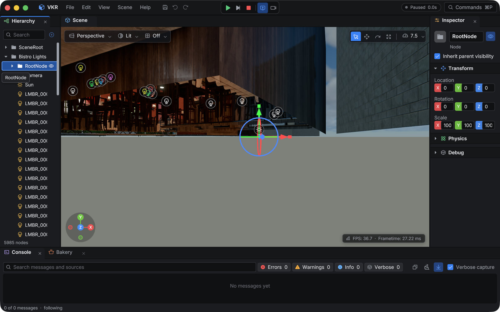
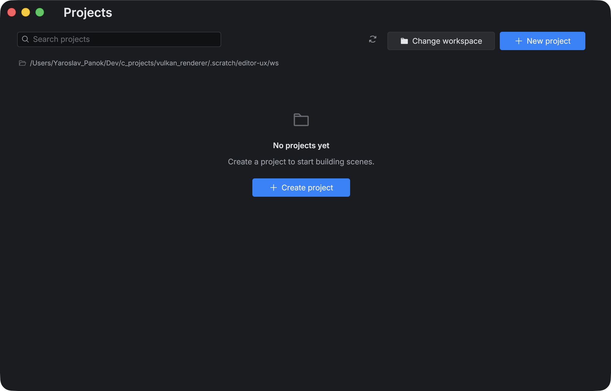
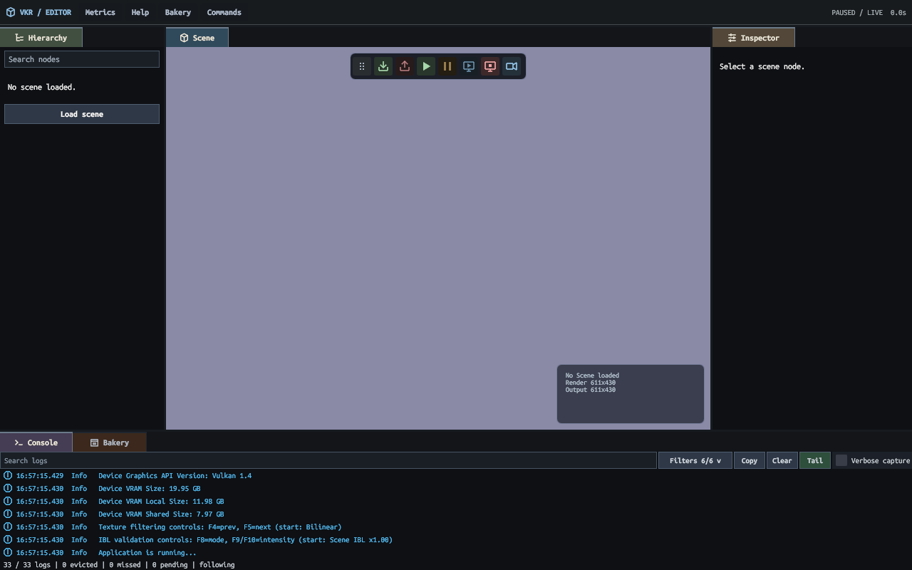
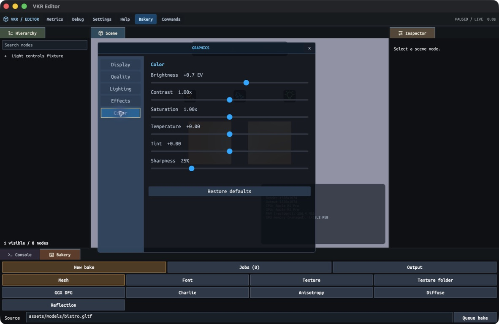
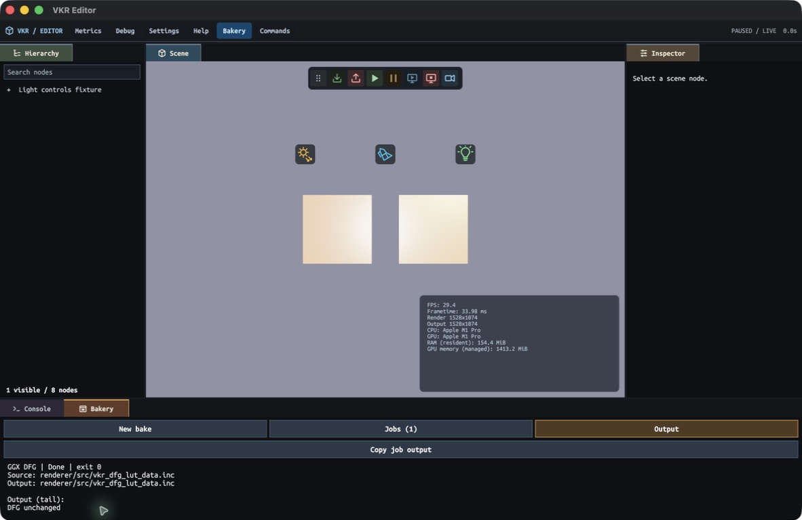

# ADR-027: Immediate-mode grid UI with retained CPU state

## Status

Accepted.

## Context

The app and editor need stable widget interaction, docked panels, text editing,
and native-resolution overlay drawing without a second renderer-owned UI scene.

## Decision

Callers build UI each frame through an immediate-mode API. The UI system retains
state by stable widget ID, including interaction, text editing, scroll offsets,
last layout, and reusable draw storage. Layout uses grid tracks only. Input
hit-testing uses the previous frame's retained rectangles.

`vkr_ui_end()` completes focus, input capture and tooltip text borrowing.
Layout, hashes, damage and draw geometry resolve once in
`vkr_ui_system_prepare_draw_list()`. Before that resolution, the runtime's
projection callback can update current-frame widget rectangles by stable ID.
The editor uses this boundary to keep light icons on the same unjittered camera
pose and Scene rectangle as the submitted packet, including camera motion and
dock resizing. Rectangle changes after preparation are rejected.

The system lowers the complete visual tree to ordered, scissored batches of
vertices and indices. When the tree, target, and scale are unchanged, it reuses
retained CPU geometry; each frame still uploads and draws that stream. Tile
hashes expose changed regions but do not imply a cached GPU target.

The dock tree is bounded, validated, and persisted as JSON. Its scene panel
rectangle drives editor viewport mapping. UI is composited after Scene output
at the drawable's native extent. In-window leaves support compact tab stacks,
reordering, edge splits, and resizing. Drawing, tab hit-testing, and drop insertion
share dock geometry; stable tab IDs survive moves. Recursive subtree minima
preserve 96-point panel width and 64-point content height when the window fits;
smaller windows divide the shortage proportionally. The editor saves its layout to
`.vkr-editor-layout.json` unless `VKR_EDITOR_LAYOUT_PATH` overrides or disables it.

App and editor performance widgets show FPS/frame time, render/output extents,
CPU/GPU models, process resident RAM and managed GPU memory. The neutral
sample runtime copies hardware identity at startup and refreshes memory text
once per second in fixed owned buffers. UI callbacks borrow those strings only
through build. RAM uses the OS resident/working-set count, including shared
mappings; GPU memory uses Metal's managed budget charge (heaps, external resources and
transfer rings) or Vulkan's renderer-owned committed allocations, prefixed with
`~` when totals are approximate. Device-wide Vulkan heap usage is not process
consumption. These counters can overlap on unified memory and are not
additive. Unavailable queries display unavailable. App output is the native
presentation extent; editor output is the Scene image extent.

Text labels, buttons, checkboxes and text fields size to measured content plus
padding and borders. A caller's explicit minimum applies on each axis; a stretch
track does not enlarge the text box by itself, except that a text field placed
with horizontal STRETCH fills its cell's width, as a native input keeps its
width while text is typed; its height stays its content's. Text fields have no implicit 120-by-24-point minimum. A button with a
`trailing_icon`, such as a dropdown's caret, measures the icon into its content
and reads from its leading edge, as does a button with `leading` set. Panels and scroll containers still fill their tracks;
intentional fixed interaction regions, including Console detail, declare their
minimum dimensions. Maximum dimensions bound overflow and wrapping.

App debug panels use content-derived dimensions instead of fixed minima. Text
line bounds, row gaps, padding and borders determine their size. The performance
block receives its wrapping width before measurement, capped by the panel's
380-point maximum and the available window width.

`VkrUiTheme` owns the editor's color, spacing, radius, type-size and motion
tokens; widgets derive hover and pressed colors from them unless a style sets
its own (`VKR_UI_COLOR_NONE` disables a derived state). Inter Regular and
SemiBold (SIL OFL 1.1) supply UI text and headings; Ubuntu Mono remains for the
Console and numeric readouts. Icons are glyphs from Phosphor regular and fill
(MIT), cooked to MTSDF atlases like other bootstrap fonts and emitted as text
quads; `VkrUiIcon` maps each editor icon to one codepoint.

The UI vertex is 96 bytes with a per-vertex mode: flat quad, MTSDF text, bitmap
text, SDF box or image. The box mode evaluates a rounded-rectangle distance
with per-corner radii, an inner border and an optional feather, which also
draws soft shadows. One UI pipeline serves every mode on Metal and Vulkan;
batches split only on texture and scissor. Polygon lowering remains for the
animation graph's bezier ribbons.

Hover, press and keyboard focus ease exponentially through retained per-widget
factors. Tooltips appear after 0.45 seconds and fade in. Checkboxes, sliders,
text fields (border and blinking caret), focus rings and scroll thumbs use the
same tokens. Labels may center their icon and text. A label or button whose
text overflows its box clips to that box. Word wrap breaks between words; a word
wider than the line breaks per glyph, and trailing spaces do not count toward a
line's width. Widgets request pointer shapes (I-beam for fields, hand for
sliders, resize and grab cursors for splitters and tab drags) through
`vkr_window_set_cursor`.

The top bar hosts the brand, File/Edit/View/Scene/Build/Develop/Help menus
(Build and Develop from [ADR-078](078-project-build-and-packaging.md)), save/undo/redo,
Projects/Scenes, a play-state pill with unsaved-edit state, the Cmd field, and
a transport group (play/pause, step, stop, Scene rendering, camera capture)
in its own column between two flexible gaps, centered between the left and
right controls and never over them when the window narrows. Menus are anchored popups that switch on hover while one is open,
close on a press anywhere outside the popup and its title, and their items
share the command table's names, icons and shortcuts.

One keymap (`s_keymap` in `editor_windows.c`) binds keys to those commands
after Unity's conventions, with Cmd in place of Ctrl on macOS: Ctrl+S save,
Ctrl+Z undo, Ctrl+Y or Ctrl+Shift+Z redo, Ctrl+K the Cmd field, Ctrl+Space the
Content browser, Ctrl+= / Ctrl+- / Ctrl+0 interface zoom, Ctrl+1 to Ctrl+9 and
Ctrl+PageUp / Ctrl+PageDown workbenches (ADR-089), F1 controls, Q/W/E/R
tools, Shift+F frame, F free camera, End snap, Ctrl+D duplicate, Delete delete, F2 rename, B brush
drawing, Shift+X the clip tool, Ctrl+P play (again stops and resets),
Ctrl+Shift+P pause and resume, Ctrl+Alt+P step, Ctrl+B build and run,
Ctrl+Shift+B build settings. A plain
key acts while the Scene or no widget holds the keyboard and a modified one
unless a text field does; none act while the camera flies or a menu or the Cmd
field is open. Windows key messages name Shift, Ctrl and Alt by their generic codes. The
window ([vkr_window_windows.c](../../runtime/src/platform/vkr_window_windows.c))
reports the left or right key, telling them apart by scan code or the
extended-key bit. As on macOS, it also keeps the generic Shift and Ctrl keys
down while either side is. A lost focus releases them all, since Alt+Tab
releases its keys in the other window. Menus, toolbar tooltips and the controls window print each
command's first binding from the same table, so a hint cannot disagree with
its key. The editor owns save and undo, so the runtime's own Ctrl+S and
Ctrl+Z stay off under it; the runtime keeps F, F3 and Tab for the free camera
and its F-key diagnostics. The paneled
editor merges this bar with the title bar, and the UI publishes the bar's empty
space as the drag region each frame so controls keep their clicks. On macOS the
window draws under a transparent native title and keeps the system window
buttons; native fullscreen auto-hides the title bar's empty unified toolbar,
which would otherwise cover the top bar. On Windows `WM_NCCALCSIZE` removes the caption row but keeps the side
and bottom resize borders, and insets a maximized window by its frame.
`WM_NCHITTEST` answers `HTTOP` in the top resize band and `HTCAPTION` inside the
published region. `WM_NCMOUSEMOVE` is forwarded to input, so hovering a control
still withdraws the region. Because `vkr_window_draws_caption_buttons` is true
only on Windows, the bar draws minimize, maximize/restore and close buttons
there. Floating windows, menus and popups have input priority above
the Scene header. The Scene's tools (brush drawing, face handles, the clip,
path and terrain tools) take a press only where no window, menu, popup or
header covers the image. Every floating window resizes from borders just past
its right and bottom edges, down to 280 x 140 points, and the text windows
(Draws, Memory, controls) scroll.

In project-managed mode the editor starts as a compact, centered 1000 x 640
point launcher. With no project open, the Projects view fills that window: its
heading shares the title row with the window controls, search and workspace
actions form a toolbar, and an empty workspace offers one Create action. Opening
or creating a project grows the same window to 1680 x 1050 points, clamped to
the screen work area and centered; returning to the launcher state shrinks it.
`vkr_window_resize_centered` takes points on both platforms, and Windows scales
them by the window DPI. A running project shows Projects as a dialog over the
editor instead.

View > Zoom interface (Cmd/Ctrl with =, - or 0) scales all UI, including dock
geometry, and Reduce motion disables eased transitions; both persist with the
project settings. Toasts announce saved scene edits and finished Bakery work.

A header pinned to the Scene groups the current camera view, rendering mode,
grid, Show and Scalability controls in dropdowns, with the
Select/Move/Rotate/Scale tools (Q/W/E/R), a World/Local axes toggle, the
Snapping chip (where spawned objects land; [ADR-076](076-project-object-model.md))
and a camera speed chip on its right. The speed chip shows the speed; its dropdown holds a
logarithmic 0.1-100 units-per-second slider and a 0.5-20 mouse sensitivity
slider (default 6, saved with the editor preferences) and an Invert mouse Y
toggle, and the wheel over the chip steps the speed. The wheel while the
camera flies steps it the same way (24 lines span the range); nothing zooms
the perspective lens, which stays at 70 degrees
(`VKR_STANDARD_SCENE_CAMERA_FOV_DEGREES`). Invert mouse Y is the
machine-local Graphics setting `invert_mouse_y`: captured upward motion looks
up unless it is set, in the Scene camera and in gameplay, which read it from
`InputState.invert_look_y`. Mouse look turns 1/60 degree per pointer count at
sensitivity 1, independent of frame rate; gamepad sticks remain rates scaled
by frame time. While the camera is held on Windows, look reads raw mouse input
(`WM_INPUT`) and clips the hidden cursor to the window centre. Show toggles geometry kinds (static meshes, animated meshes, shapes), object
icon categories, the grid and its depth test, collision display and the session
physics override; hidden geometry is neither drawn nor picked
(`VkrScene.editor_hidden_kinds`) and the scene stays unedited. Scalability
applies a Low, Medium, High or Epic preset of the quality gates, opens the
custom settings, and sets the screen percentage or dynamic resolution live.
Every dropdown is one button whose trailing caret lays out inside its padding
(`VkrUiWidgetConfig.trailing_icon`), and popups that would leave the Scene open
leftward from their chip. The gizmo shows
only the active tool's handle family; Select shows no handles, only the
selection outline, and dragging an object with it moves the object in the view
plane as one undo entry. Move and rotate follow the world axes or, in Local, the object's;
scale handles always follow the object's axes. F frames the selection. An orientation
gizmo in the Scene's lower-left corner draws the camera's axes and requests the
matching view when an axis cap is clicked. Narrow Scene panes replace the view
groups with a Viewport overflow menu. This grouping follows the user-requested
[Unreal Engine 5.6 viewport toolbar](https://dev.epicgames.com/documentation/en-us/unreal-engine/viewport-toolbar?application_version=5.6)
as design inspiration. Controls use the existing retained input rectangles and
submit `VkrSampleViewRequest`; the runtime owns validated state. The view bar
has input priority above transport and below floating windows and menus.
Camera/projection and rendering behavior belong to
[ADR-046](046-editor-viewport-mapping-and-picking.md) and
[ADR-044](044-shader-cross-backend-contract.md#editor-inspection-views).

The optional world grid lies on XZ at y=0 in Perspective, Top and Bottom, and YZ
at x=0 in Left and Right, through the world origin. The renderer draws it in the
`Editor.Grid` pass over the Scene image, before the selection outline and
handles: each pixel intersects the plane with the unjittered camera ray, so the
grid is continuous to the horizon, and the opaque depth hides it behind nearer
geometry unless Show > Grid through geometry is on. The depth test tolerates
0.2% of the surface distance plus the plane's change across two render-scaled
depth texels and a pixel, so a floor lying on the plane keeps the grid on top
through jitter and reduced screen percentage instead of z-fighting. Lines anti-alias from their screen footprint;
levels step by ten from the requested cell size and cross-fade as the camera
zooms, the next level drawing the majors, as in UE5. Zoomed in past the finest
level, its sparse lines strengthen from minor to major alpha over the next
decade (about 60 pixels between lines), so the grid keeps its contrast close
to the plane. Perspective fades the grid only with distance, between 35% and
100% of a distance that grows with camera height above the grid.

The XZ grid lies at a per-scene height (`VkrSampleViewState.grid_height`,
saved with the scene's editor state), because some floors are modelled above
the origin: Bistro's pavement sits 0.14-0.47 m up, which hides a grid at zero.
Grid > Fit to surface (`grid.fit`) sets it from the surface at the Scene's
centre: the nearest collision of the scene and its World, else the opaque
depth the GPU pick resolves at that pixel, unprojected with the camera of the
request. Reset height returns it to zero, and `grid.height <y>` sets it.
Placement onto the ground plane uses the same height, so scenes without
collision place objects on the fitted floor. The backends shift the grid by
translating its unprojection along the plane's normal. The left and right
views' ZY plane and the front and back views' XY plane lie at the depth the
view is framed on, so a side view away from the origin still shows its grid.
The X, Y and Z axis lines are red, green and blue.

Orthographic views can label cells in screen order: numbers 1..N left to right
along the Scene's top edge and letters A.. top to bottom along its right edge,
continuing through Z, AA, AZ, BA and AAA. Labels mark the cells of the level the
renderer draws at full strength, computed on the CPU from the same footprint,
and the Grid button reports that size; Smaller/Larger change the requested cell
size. Each label sits at its cell center, so panning or zooming renumbers the
visible cells; labels are viewport references, not world coordinates. Each edge
reserves the other's corner strip, and crowded labels are omitted before
numbering. Perspective shows no labels. The grid has no scene-picking ownership.

Panels use the shared field, action, primary, ghost and toggle styles; read-only
fields, disabled actions, severity and follow-tail states retain distinct
styling. Dock tabs show a category icon, an accent top edge when focused and a
close button; splitters highlight on hover.

Enabled visible controls support Tab/Shift-Tab focus and Enter/Space activation.
An unobstructed Scene click clears widget focus and gives Tab to free-camera
capture. Clicking a panel or control restores Tab/Shift-Tab widget navigation.
F, F3 and the toolbar camera button also toggle camera mode; F follows the
plain-key rule while the camera is free and always releases it. Escape
releases capture. Stopped or hidden Scene views do not accept camera entry.
Holding right mouse over an unobstructed live Scene captures the free camera
until release; focus loss synthesizes the right-button release. For the right
button, unobstructed means that no window, menu, popup or header layer covers
the pointer and no widget or dock gesture holds the mouse. Keyboard focus and
a hovered light icon do not block it, and the press takes keyboard focus and
the keyboard layer to the Scene. This temporary capture has separate state
from Tab/F/F3/toolbar toggles; a toggle during the hold latches the camera
until the next toggle. Camera capture clears
widget focus and consumes editor input even when its virtual pointer crosses
an overlay. The capture-entry frame consumes no mouse motion.
Window input retains press/release edges, button press positions and press-time
shortcut modifiers until frame completion. Wheel deltas accumulate within the
frame and clear at frame completion, so a single notch cannot repeat on idle
frames. Docking consumes final movement before
releasing its drag, including a complete gesture received in one event drain.
The input module selects the platform shortcut modifier for all callers.
Scroll containers capture hover and wheel input while child controls own clicks.
Tab also focuses scroll containers: Page Up/Down moves one viewport and Home/End
moves to the declared bounds. Tab then reaches the visible child controls. A
focused container keeps its border visible without moving its children's layout.
Keyboard scope follows floating input layers, including popups. Text fields
support UTF-8 clipboard input, mouse and keyboard selection, Cmd/Ctrl A/C/X/V,
read-only selection, and caret scrolling. They follow native conventions:
Option (Control elsewhere) moves and deletes by word, Command moves and deletes
to the line's ends on macOS, double- and triple-click select a word and the
whole text, and Cmd/Ctrl Z, Shift+Z or Y undo and redo up to 24 steps in the
focused field, with typing at the caret within a second coalesced. A right
click opens Undo, Redo, Cut, Copy, Paste, Delete and Select All in the editor's
context menu, which applies them through `vkr_ui_text_field_command`. Text drags retain their press anchor
through the final movement; keyboard editing ends the prior mouse selection.
The controls do not provide a native
VoiceOver or Windows UI Automation tree.

Hierarchy caches scene structure and expanded/search-matching rows when their
inputs change, then emits only its visible window. Display slots are bounded;
selection uses generation-bearing entity IDs rather than row positions. Rows
show a caret, a type icon and a visibility toggle; right-click opens Frame,
Hide/Show, Isolate, Show all hidden, Rename, Copy name, Script and Add
component submenus, Detach, Duplicate and Delete; a double-click frames the
object and opens its script. The toggle and Hide hide an object in the
editor only (ADR-084), and Show reveals it, through its saved Visibility when
that hides it. A right click
in the Scene that neither moves the pointer nor flies the camera within
0.45 s picks under the pointer, selects the object and opens the same menu,
or the creation menu over empty space; a longer or moving right press flies
the camera as before. One context-menu table serves every opener:
right-clicking a dock tab offers Close and Reset layout, and right-clicking the
Console offers Copy selected and Clear. Menus hold up to 48 rows of items,
separators and headings and one level of submenus, which open beside their
row on hover, click or Right and flip left at the screen edge. While a menu is
open it owns the keyboard: Up and Down move over enabled items, Right or Enter
opens a submenu, Left and Escape leave it, Enter acts and Escape closes.
Inspector
borrows selected component values and sends a typed edit request after validation.
It edits name, visibility, local TRS and light values in collapsible sections;
X/Y/Z and R/G/B tags and scalar labels scrub their values by dragging. Edits
apply live. One gesture (a drag, or typing until Enter or blur) coalesces into
a single undo entry for the same entity and fields, and Escape restores the
value from before the gesture. Physics edits keep their own entries. Authored
shear matrices remain read-only.
Runtime selection is shared with viewport picking, and frame selection fits the
selected subtree's mesh bounds.

Debug > Labels expands a master visibility checkbox and directional, spot and
point light checkboxes. Type choices survive the master switch. Actual ECS
components determine the label type, including imported glTF light nodes;
Bistro's punctual lights are points.

Light labels are 26-point round chips above the entity origin, drawing the
sun, flashlight or bulb icon in the light's own color, composited
at native UI resolution, outside lighting and temporal history. They are visible
through scene geometry, clipped to the displayed Scene image, hidden behind the
camera and while Scene rendering is stopped. Disabled lights remain selectable
with gray icons. Clicking an icon selects its entity in Hierarchy and Inspector;
selected icons use the accent color. Frame-scratch anchor records retain entity
IDs, never component pointers, and are discarded on the next UI build. A scene
generation change prevents their use after unload/reload. Labels reserve 96
nodes for subsequent editor controls within the shared 2048-node UI capacity;
capacity exhaustion emits a Console warning and keeps those controls reachable.
Overlapping button presses give ownership to the last drawn button. Slider
release consumes its final pointer position, including a click whose press and
release arrive together.

Inspector distinguishes directional, spot and point lights. Light enabled,
linear RGB, intensity and punctual range use the live-edit journal.
Directional and spot directions have local yaw/elevation fields and sliders;
node rotation still transforms that local direction. Spots add inner/outer
half-angle fields and sliders in degrees. Edited cones require an ordered,
distinguishable cosine interval for smooth attenuation. Unedited authored values
retain their exact representation. These controls use existing undo/redo and
sidecar persistence.

The [light-controls screenshot](../../assets/editor/light-label-controls.png)
comes from a normal Release Metal run of
[`editor_lights.scene.json`](../../assets/scenes/fixtures/editor_lights.scene.json).
`./build_editor.sh Release`, `./build_release.sh`, and `./build_test.sh` pass.
Native UI checks cover all three light types, master/type switches, icon
selection, direction sliders and Apply/Undo/Redo, light enable, invalid cones,
F3/Escape capture and Stop/Resume. A bounded Bistro run also selects imported
point lights from their labels. CPU checks cover deferred rectangle placement,
retained hit bounds, overlapping-button ownership and final slider positions.
The computer-use interface cannot hold right mouse across movement; sustained
RMB gestures and focus-loss release remain unverified natively. Windows/Vulkan
execution is unavailable on this host. No performance comparison is claimed.

Graphics Settings CPU oracles pass two round trips, twenty invalid/default and
dependency cases, restart/live classification, and missing-file handling. The
process-group cancellation oracle passes. The Release and Debug wrappers pass
without cooking log entries; a third `./build_editor.sh Release` pass also
passes. SHA-256 values for all four shared tables remain unchanged. A native
macOS Graphics check on `editor_lights.scene.json`, run on the Metal desktop
implementation removed on 2026-10-06, exited 0 and covered the Graphics menu as
the sole item, all five left tabs, the right pane, live
Bloom-off, shadows-off, SSR-off, SSGI-on, fog-off, depth-of-field and motion-blur
enablement, brightness change, persisted values, Restore defaults, and the
display Vsync restart notice. Bakery UI coverage also exits 0: the GGX recipe
reports `Done`, exit 0, and `DFG unchanged`; cancelling a running anisotropy job
reports `Cancelled`, exit 143, and leaves no cooker descendants in `pgrep`.
Final UI opacity coverage passes. Windows UI/process-tree behavior and native
Vulkan execution remain unverified.

The direct table-publication CPU check passes atomic full replacement, preserves
the destination marker after a failed replacement, rejects a missing parent, and
leaves no temporary files after handled failures. The latest `./build_release.sh`
run passes against the current source; its evidence log is
`.scratch/renderer-delivery-release-final-build.log`. The four shared-table
hashes remain unchanged after these checks.

The top bar's Cmd field (Cmd/Ctrl+K) replaces the Commands palette; its
commands, expression evaluator and scripting belong to
[ADR-075](075-editor-cmd-bar-and-evaluator.md). Navbar buttons toggle their
open dropdown, window or active Bakery tab closed; an inactive Bakery tab is
selected. The Projects and Scenes switchers open beneath their buttons, size to
their rows and offer New project or Add scene directly.

Row-style buttons (menu, context-menu and dropdown items, dock tabs, Console
rows) set `fill`, because text-bearing widgets otherwise size to their content
and would hover and click only over their label. macOS precise scroll deltas
(trackpads, Magic Mouse) are points, so the window converts them to wheel lines
of 32 points with a carried remainder; notched wheels already report lines.

Clipped single-line labels that overflow end in an ellipsis. The text is cut at
a glyph boundary using layout advances so the ellipsis fits inside the outer
clip edge, and `...` replaces U+2026 when the font lacks it. Scroll thumbs can
be dragged: the retained state keeps the grab offset, and a press in the gutter
pages one viewport toward the pointer. Panels that own their offset for
virtualization or reveal (Outliner, Details, Console, Content, Preferences,
collision layers) exchange it with `vkr_ui_scroll_area_offset`: a thumb drag,
gutter page or scroll key that frame writes the area's offset back to the
caller, and otherwise the caller's offset applies. Row-virtualized lists lay
out the visible rows at the first row's offset inside an area as tall as every
row and snap by exchanging the rounded offset again.

The Add scene page uses the Projects page layout: a Create new/Import JSON
switch above cards for environment, probe, models, lights, font and build
options. The cards form two columns at 760 points or wider. The measured form
height sizes the scroll content, so the page ends after its last card. The
Scenes view lists scenes as cards with an Open badge and rename and delete
actions, and shows an empty state when the project has no scenes. The
Animation window's timeline has a ruler that scrubs the playhead.

The Scene resolution badge also shows the runtime's averaged frame cadence
(FPS and wall-clock frametime, including the editor loop), replacing timing with
stopped/unloaded state when Scene rendering is inactive. These are not isolated
GPU pass timings.

The
editor accepts a project-relative `--scene <scene.json>` or `VKR_SCENE_PATH`;
the default remains
Bistro. Cmd/Ctrl+S saves committed edits, and Cmd/Ctrl+Z / Shift+Z undo/redo
when a text field does not own keyboard editing.

The runtime owns 128 undo entries and releases them on scene replacement. A whole
gizmo drag becomes one entry before selection or transport actions can end it. Explicit Save writes `<scene>.editor.json` atomically,
using source entity/node identities and fingerprints. Loading validates complete
JSON, resolves every source identity and stages names before mutation. A conflict
leaves the source scene unchanged and prevents overwriting the conflicting file.
Rejection diagnostics distinguish malformed files, unavailable sources, duplicate
identities, changed fingerprints, incompatible fields, and staging failures. A
fingerprint conflict reports the record, source identity, and saved/current hashes.
Original glTF and scene JSON files are not rewritten. Reload/unload refuses unsaved
committed edits. These sidecars are applied by the shared interactive app/editor
runtime; harness scene loads do not implicitly consume editor overrides.

Console keeps 2,048 structured records with stable sequences, severity, source,
UTC time and bounded message text. Producers append under the existing logger
mutex; the UI copies at most 256 new records per build. Each history ring uses
4,653,056 bytes, with one logger ring and one editor snapshot ring. Eviction,
truncation and lag remain visible. Text/source search, severity filters, follow-tail,
record/range copying and read-only detail selection operate on copied data.
Rows pair distinct severity icons with red/coral, amber, blue, violet and green
text in the monospace face; text labels preserve severity without relying on
color. Errors, Warnings, Info and Verbose are toggle chips that show each
level's record count.
The editor requests capture before logging starts (`log_capture_request`),
so the ring holds the session from its first record at an INFO threshold.
Release compiles INFO and above in; Debug and `VKR_EDITOR_LOGGING` builds also
compile DEBUG/TRACE, which Verbose capture enables before formatting. A
process that does not request capture, such as the app, allocates no ring and
keeps its threshold at ERROR in Release, so its output is unchanged. Each
session also appends every record to
`<workspace>/logs/<UTC start>-<pid>.log`, starting with the ring's backlog;
each line is flushed as it is logged so the file survives a crash, and
opening another workspace continues in a file there.

Bakery queues twelve recipes—mesh, font, single texture, texture directory, GGX
DFG, Charlie, anisotropy, diffuse volume, reflection probe, collision hull,
collision mesh and shaders—on one worker. The worker launches one cancellable
[`vkr_bakery`](077-asset-build-system.md) child with explicit arguments, writes no
renderer state, terminates the complete child process tree on cancellation, and
publishes completion before the UI reads results. Shutdown cancels and joins the
worker. New bake separates mesh, font, single texture and texture-directory
sources, retaining each source draft when the type changes. Jobs shows textual
status, selection, cancellation and retry, and per-action progress parsed from
the child's JSON event stream; warnings and errors also reach the Console.
Output shows a wrapped 4 KiB display tail and copies up to 16 KiB of captured
status/output. Controls stack in narrow docks. Mesh jobs accept `.obj`, `.gltf`
and `.glb` and replace the source extension with `.vkb`. Cook, table and shader
recipes hit the action cache for unchanged inputs; Force ignores those hits.
`vkr_bakery` publishes every product atomically, so a cancelled or failed job
leaves the previous artifact or shared table intact. Reload the scene after
mesh or texture baking; restart the editor after baking a font it already
loaded. Build wrappers compile `vkr_bakery` and the shader catalog without
cooking assets; Bakery cooks. Pinned bootstrap
fonts keep the first editor launch independent of Bakery; see
[ADR-034](034-offline-cooked-font-artifacts.md).

The diffuse recipe starts from the tracked
[enclosed-room example](../../assets/scenes/fixtures/bakery_diffuse_room.scene.json)
and writes `assets/textures/bakery_diffuse_room.vkdv`. Its mesh, glTF source,
buffer and material are checked in. The planar `diffuse_volume_local` scene is
only a runtime lookup witness and cannot supply automatic three-dimensional
bake bounds. Invalid bounds report their extents before room detection; bake
failures forward the final 4 KiB of child output and the exact full-log path to
Bakery. The room proof and existing bake budget remain unchanged.

The repaired default passed the full 4×4×4, face-size 16, 64-sample, depth-12,
one-million-photon CPU recipe: 27 valid probes, one valid cell, 7,644-byte DVOL,
finite nonzero SH, valid CRCs, and a `current` freshness result. The Release
editor wrapper passed without cooking. This is CPU-baker evidence; it does not
establish native Vulkan execution.

The sample runtime owns player Graphics settings in `VkrGraphicsSettings`.
Settings > Graphics uses a left tab rail and a clipped, scrollable right pane
with Display, Quality, Lighting, Effects, and Color tabs. The editor borrows
current state during UI build and sends a typed `VkrGraphicsSettingsRequest`;
the runtime validates and applies the request. HDR and temporal upscaling are
startup-owned values and set a restart-required notice when changed. The
graphics pipeline class follows the backend and has no setting
([ADR-087](087-gpu-class-graphics-pipelines.md), decision 7). Vsync switches
between frames (`vkr_renderer_set_present_mode`: the Metal layer's display
sync, a recreated Vulkan swapchain); a windowed macOS editor still presents at
most once per display refresh, because the compositor paces the layer's
drawables. Render scale and dynamic resolution apply between frames when the
renderer reports the scale inside `vkr_renderer_render_scale_range` (Vulkan FSR
3.1 and the spatial Metal path accept 1/3..1); otherwise they also wait for a
restart. Vulkan without temporal upscaling renders at unit scale, so render
scale is disabled there and the Scene percentage reads 100%. Dynamic resolution
exists only on Metal, as the tiled pipeline's adaptive quality (ADR-087,
decision 12). With it on, the render scale caps the scale the controller
chooses, so Metal defaults to 1.0. The frame limit is read every frame. Other
controls apply to live frame state; lighting changes invalidate the relevant
shadow and temporal histories.

Settings load from `VKR_GRAPHICS_SETTINGS_PATH`, or the project
`.vkr-graphics-settings.json` default when the variable is absent. The
project-managed editor ignores both and uses a machine-local `graphics.json`
([ADR-069](069-editor-projects-and-workspaces.md)). Missing files
keep backend defaults; invalid files leave defaults intact and report a message.
Changes save after 0.25 seconds without another edit and flush during shutdown.
Saving uses a temporary file and atomic rename. The persisted record is versioned
JSON and validates every field and cross-field constraint before publication.

The 2026-09-25 visual overhaul (theme, fonts, icons, box primitive, top bar,
launcher and panel restyle) passes `./build_test.sh`, `./build_release.sh` and
`./build_editor.sh Release` on macOS. CPU oracles cover the box vertex data and
radius, relaxed batching, glyph vertices rejected from untextured batches, dock
toolbar height and tab widths, and word wrap. Isolated Release Metal captures on
Bistro cover the top bar, menus, selection and Inspector, the orientation gizmo,
light chips and the Console. Separate captures on a fresh workspace cover the
launcher and its growth into the editor after creating an empty project. Native
Vulkan execution, Windows compilation and the Windows caption are unverified,
and no performance comparison is claimed.

The 2026-09-26 follow-up (full-row hover, Cmd field, Add scene cards, scroll
conversion, context menus, ellipsis, scrollbar drag and the selection outline)
passes `./build_test.sh`, including word-wrap and scroll-thumb drag oracles, and
`./build_editor.sh Release` on macOS. Isolated Release Metal captures on Bistro
cover pointer glides over menu and dropdown rows, typing and completion in the
Cmd field, the Add scene cards, the Projects dropdown, the empty Scenes view,
label ellipsis and the selection outline. The Windows caption has not been
compiled because no Windows toolchain is available. The dock-tab and Console
context menus were not opened natively. The timeline ruler was not exercised
because Bistro has no animation, and the Scenes cards were not captured with
real scenes. The controls still expose no
VoiceOver or UI Automation tree.

## Consequences

Widget IDs must be stable across frames. The macOS title bar drags only where
the UI publishes a region, so the top bar must publish it every frame, including
in the launcher. New geometry may have one-frame input
latency because hit tests use prior rectangles. Retained storage survives frame
scratch resets; changed-frame nodes and commands use frame scratch. The UI
direct path owns no persistent render target.

## Alternatives considered

A retained application widget tree duplicates caller state. A flex layout engine
adds a second layout policy. A persistent cached target adds storage, compositing,
and invalidation work without an implemented benefit.

## Revisit when

Measured UI cost justifies a target cache or a product requirement needs a
layout behavior grids cannot express.

## Code evidence

- [UI state and lowering](../../runtime/src/renderer/systems/vkr_ui_system.c)
- [grid solver](../../runtime/src/core/ui/vkr_ui_grid.c)
- [dock tree](../../runtime/src/core/ui/vkr_ui_dock.c)
- [editor UI caller](../../editor/src/editor_ui.c)
- [theme tokens](../../runtime/src/core/ui/vkr_ui_style.c)
- [UI vertex and batches](../../renderer/src/vkr_ui_draw_types.h)
- [editor commands, menus and top bar](../../editor/src/editor_windows.c)
- [project launcher](../../editor/src/editor_projects.c)
- [viewport controls and world grid](../../editor/src/editor_viewport.c)

- [editor scene panels](../../editor/src/editor_scene_panels.c)
- [edit journal and sidecars](../../runtime/src/renderer/systems/vkr_scene_edit.c)
- [Console](../../editor/src/editor_console.c)
- [Bakery](../../editor/src/editor_bakery.c)
- [Graphics settings](../../runtime/src/vkr_graphics_settings.c)
- [Graphics Settings UI](../../editor/src/editor_graphics.c)
- [Sample runtime settings owner](../../runtime/src/vkr_sample_runtime.c)
- [Sample runtime startup options](../../runtime/src/vkr_sample_runtime_config.c)

The Graphics Settings and twelve-recipe Bakery additions are source-integrated.
CPU oracles, macOS UI/Bakery checks, and Release/Debug/editor wrapper evidence
pass. Windows UI/process-tree behavior and native Vulkan execution remain
unverified; this ADR does not claim those gates have passed.
