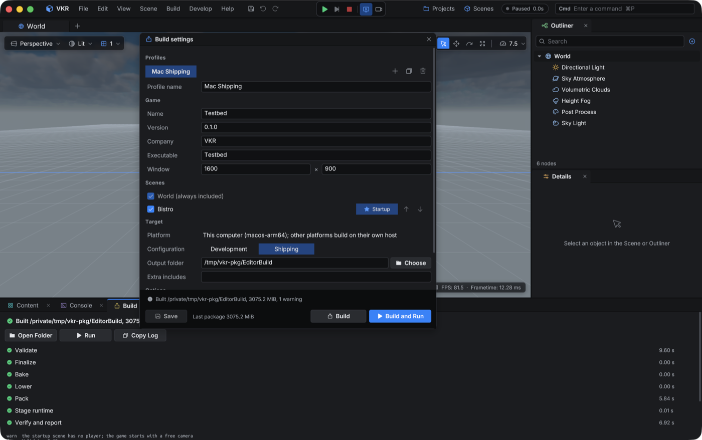
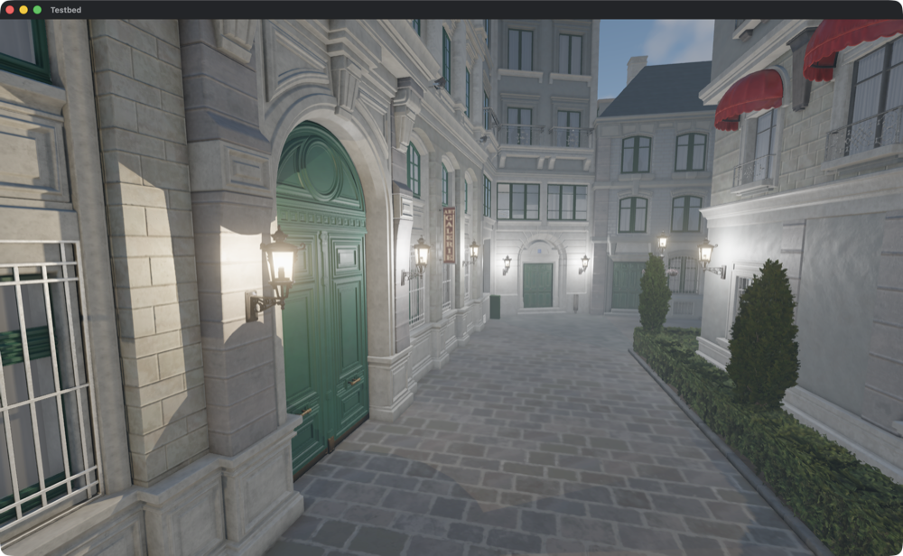
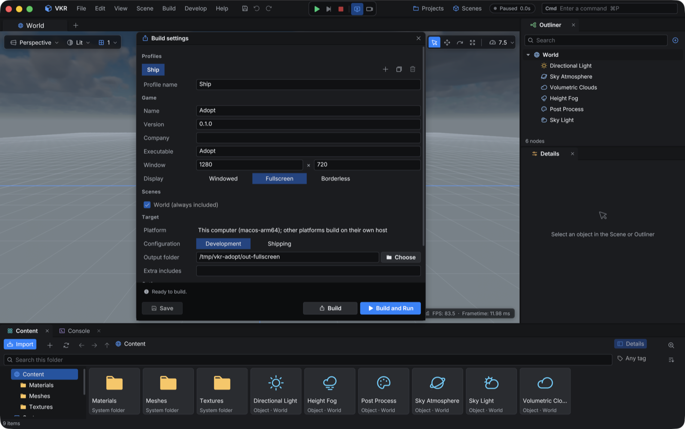

# ADR-078: Project build and packaging

## Status

Accepted. Phase 1 of the
[project packaging proposal](../proposals/project-packaging.md) and the
relocatable editor distribution are implemented and verified on macOS/Metal.
The Windows/Vulkan package and distribution gates have not run. Incremental
packages and shipping polish remain in the proposal.

## Context

[ADR-077](077-asset-build-system.md) packed repository recipes into bundles, but
a managed project could not ship. Lowered scenes named absolute workspace paths,
only the editor loaded the root World, and the sample app carried harness and
debug controls. The user chose these on 2026-09-29: game settings and build
profiles in `game.json`; overlays ship with rewritten references; a separate
`vkr_player` executable; and a Build menu, with Bakery moved to a developer
menu.

## Decision

**Game settings.** `game.json` beside `project.json` holds the `game` object
(name, version, company, executable name, startup scene, ordered included
scenes, window size and Graphics defaults) and a `profiles` array (name,
platform, `development` or `shipping`, output folder, project-relative extra
includes, `bake_lighting`, `run_after_build`). The
[project store](../../editor/src/editor_project_store.h) parses and writes it.
It saves through a staged file and merges members it does not own back under
its own. Without a file, a project packages every scene, starts in the first,
and has one development profile named after the project. The bundle command
applies the same rules and owns validation: the name, an executable name without
separator or extension, a window mode of `windowed`, `fullscreen` or
`borderless` with a window size of 320x240 to 16384x16384, and a startup scene
among the included scenes.

**Command.** `vkr_bakery bundle <project directory> [--profile <name>] [--out
<dir>] [--template <dir>]` ([package](../../tools/bakery/vkr_bakery_package.c))
runs seven stages. Each is a `start`/`done` event pair with coded diagnostics:

| Stage | Work |
|---|---|
| Validate | Settings, profile, host platform, player template, and an output outside the workspace directory and repository. An existing output must hold a `bundle.json` or be empty. Portable lowering of the World and every included scene. Warns when the startup scene has neither a Player Start nor an `fps_player` ([ADR-079](079-c-script-modules.md)). |
| Finalize | `finalize_textures` for a scene with preview or deferred assets (the job publishes the scene), and `finalize_project_assets` when project assets are. The returned inventory is lowered against without publishing `project.json`, which the editor owns. Shipping finalizes with the final encoder, development with the fast one. Fast-encoded final textures are not re-encoded; the report counts them. |
| Bake | With `bake_lighting`, `bake_scene` with reflection and diffuse for each included scene. |
| Lower | Lowers again only when an earlier stage published. |
| Pack | Walks the closure over identity mounts: staged documents, `project/` to the project directory, `editor/` to the editor bundle, `assets/` to the template's engine resources. Rejects a document naming the workspace directory or the repository. Writes `content/game.vkpak` and `content/engine.vkpak` (`assets/...`), compressing the chunks the runtime reads into memory (ADR-077); an archive whose entries all match the previous package's `products`, written by the same `archive_writer`, is cloned from it instead. |
| Stage runtime | Copies the profile's player as `<executable>[.exe]`, the template's libraries, and only the host backend's shader catalog. Writes `bundle.json` version 2. On macOS the package is `<executable>.app`: the player in `Contents/MacOS`, an Info.plist (`com.<company>.<executable>`, the game version) and the rest in `Contents/Resources`, signed with `codesign` using the profile's `signing_identity`, else ad hoc. |
| Verify and report | Validates and rehashes both archives, then renames `<out>.staging` over `<out>`. |

Project jobs run as child `vkr_bakery project` processes, so publication keeps
its owners. The package is assembled in `<out>.staging`; a failure or
cancellation removes it and keeps the previous package. Each run writes
`<workspace>/logs/builds/<UTC>-<n>.json` with stage durations, warnings, bytes
by loader kind and by first-reaching scene, the largest files, the archives and
any finalized inventory.

**Portable lowering.** A read-only `prepare_scene` request with `portable: true`
([lowering](../../tools/bakery/project/vkr_project_lower.c)) writes the same
runtime scene with content identities instead of absolute paths. Scene assets
map to `project/scenes/<id>/...`, project assets to `project/...` and editor
fonts to `editor/...`. Overlay collider assets change from workspace-relative
paths to identities. `project_assets` substitutes a finalized inventory. The new
`package_world` operation checks that every `./` and `../` string of
`world.scene.json` names a file inside the project and that no string is
absolute. It ships the document byte-identical, because without a
`source_identity` the World overlay binds entities by a fingerprint of those
bytes. The overlay is rewritten like a scene's. Identities mirror the project
directory, so owner-relative material and texture references keep resolving.
The closure resolves `./` and `../` against the owning document only and ships
a mesh's `.remap.json`.

**Package layout.** `bundle.json` version 2 keeps version 1's members, drops
`scene`, and adds `game`: `world`, `world_overlay`, `startup_scene`,
`startup_overlay`, `scenes[]`, `fonts[]` (`default-scene-font` falls back to the
engine's UbuntuMono configuration), `window`, `graphics`, and `startup_camera`,
the startup scene's editor viewport recall without selection. The
[vfs](../../lib/src/filesystem/vkr_vfs.h) reads only root members, through
`vkr_json_find_root_field`, and keeps the description for the player. It
finds `bundle.json` beside the executable, or in `Contents/Resources` for an
executable in a bundle's `Contents/MacOS`; the
[shader catalog](../../renderer/src/vkr_shader_catalog.h) looks in
`../Resources/shaders` the same way.

**Template lookup.** `--template <dir>`, then `templates/player` beside the
running `vkr_bakery`, as the editor distribution ships it, then the build
tree's `<build>/player`. `template.json` names its players, engine resources,
shader catalog and optional `libraries` directory, each absolute or relative
to the template. The engine resource list lives in
[`vkr_engine_content.cmake`](../../cmake/vkr_engine_content.cmake).

**Player.** `vkr_player` (development: INFO logging and the F6 overlay) and
`vkr_player_shipping` (errors only, no developer UI) are prebuilt in every tree
under `<build>/player`. So are `template.json` and `engine/assets`, which hold
the render graph and runtime fonts of the former Bistro recipe with the files
they name, including the Windows UI font configuration
(`NotoSansCJK-Windows.fontcfg`) the runtime loads there, and the default
mannequin with its credits notice
([ADR-080](080-default-mannequin-character.md)). On macOS the template's `lib/` holds the Vulkan loader, which the
players link as `@rpath/libvulkan.1.dylib`; a package copies it into
`Contents/Frameworks` and signs it before the application, and the players'
rpath lists `@executable_path/../Frameworks`. Before, a package loaded the
loader from the building machine's Vulkan SDK. The [player](../../player/src/main.c) mounts the package, then opens
the World and the startup scene with their overlays on its first frame through
the same requests the editor issues. It registers the package fonts and applies
the startup camera once the scene activates. A scene's player entity starts
gameplay; Escape opens Resume, a Fullscreen/Windowed switch, an Invert mouse
Y toggle saved with the game's preferences, and Quit. The
player enters `game.window.mode` once its window exists through
`vkr_window_set_mode` ([window](../../runtime/src/core/vkr_window.h)). On macOS,
`fullscreen` is the native fullscreen Space, requested from the event pump once
the application is active, and `borderless` is a frameless window over the whole
screen with the menu bar and Dock hidden. On Windows both are a borderless popup
over the monitor, since the renderer requests no exclusive fullscreen. Leaving
either mode restores the previous frame, and resize events carry the new extent
to the swapchain. Graphics preferences read `game.graphics`
as defaults and live in `%APPDATA%/<company>/<name>/settings.json` or
Application Support. A package carries host-native textures that load as
stored, so it writes no texture cache (ADR-012); each platform's package
builds on that platform.

**Editor.** A Build menu (Build, Build and Run, Build Settings..., Open Last
Build, Build log) and a Develop menu (Bakery, Draws and render graph, Memory)
sit beside Scene; Scene gains Bake lighting. The Build settings window edits
profiles, game fields, included scenes with order and Startup, configuration,
output folder, extra includes, bake and run options and Graphics defaults.
Build saves `game.json`, then runs the preflight: the existing Save/Discard/
Cancel prompt for any container with unsaved edits, then a drained preference
writer. The package job runs as `EDITOR_BAKE_PACKAGE` on Bakery's single worker,
so it never overlaps a project job. A status strip shows the stage and Cancel.
The Build tab shows the stage checklist and durations, the diagnostics, the
log, Open Folder, Run and Copy Log. A diagnostic whose source is a package
identity or a host path has Reveal: the identity maps back to the project or
editor-bundle file, and `vkr_editor_content_reveal_path` selects the asset whose
artifact it is, else the asset whose build revision holds it, in its Content
folder. `content.reveal <path>` runs the same step. Build and Run forwards the game's output to the Console as
`[game]` lines. `build.game [profile]` and `build.run [profile]` hold the Cmd
queue and report the result
([ADR-075](075-editor-cmd-bar-and-evaluator.md)).
[`editor_build.c`](../../editor/src/editor_build.c) owns this workflow.
A package's reflection-probe bakes render through the `vkr_harness` beside
`vkr_bakery`, as a distribution ships it, else the build tree's
(`VKR_BAKERY_HARNESS_DEFAULT`); a scene with probes fails its bake without one.
On Windows the package jobs share one log for both output streams, which
`vkr_platform_process_run` opens once, and `file_rename` retries a replace for
about a second while the package polls the job's progress document, since the
CRT reader grants no delete sharing.

**Editor distribution.** `build_editor_dist.sh [folder]` (or `.bat`) builds the
Release editor and runs `cmake --install --component editor`
([rules](../../editor/CMakeLists.txt)) into one relocatable folder:
`vkr_editor`, `vkr_bakery`, `vkr_harness` and `vkr_asset_preview` side by
side, the Vulkan loader beside them on macOS, `resources/editor`, the shader
catalog in `shaders/`, the engine content in `content/`, and
`templates/player`, whose `template.json` names `../../content` and
`../../shaders`, and the script SDK headers in `sdk/`
([ADR-079](079-c-script-modules.md)), which the installed Bakery compiles
project scripts against. The content is the package engine set plus the offscreen
profile probe bakes copy. Every program takes its content root from a
`content/` directory beside its executable when one exists, else the
repository it was built from (`vkr_content_root_is_repository()` in the
[mounts](../../lib/src/filesystem/vkr_vfs.h)). With an installed root the
render graph comes from content, the editor passes that root to its jobs as
`--root`, working directory and legacy root, and the harness runs children in
it. [`editor_install.c`](../../editor/src/editor_install.c) takes each
companion program from beside the editor, else from the build tree. An
installed editor keeps pre-workspace Bakery logs in `<cache>/VKR/bakery`, where
`<cache>` is
`%LOCALAPPDATA%` or `~/Library/Caches`
(`vkr_platform_user_directory`). It has no shader sources, so the shader
watcher stays off. A package may not lie in or name the installed content, as
for the workspace and the repository. On macOS FreeType and libpng link
statically, so no program loads a Homebrew library; Windows links the static
vcpkg triplet and the system Vulkan loader.

## Consequences

- A project ships without the editor, workspace or repository. Overlays and the
  World need no second application path, and the runtime has one boot path.
- Package bytes do not depend on the build path: the editor's `build.game` and
  the command line write identical archives for one profile.
- A project-asset finalize publishes revisions the manifest does not name yet.
  After an editor build, `vkr_editor_projects_adopt_inventory` publishes the
  report's inventory while the project inventory still matches its SHA-256 at
  the build's start, then points World models at the new revisions; otherwise
  workspace cleanup removes the revisions after 24 hours and the next build
  finalizes again from the cache. A command-line build never adopts, and the
  package's World keeps the revisions its document names.
- Every package carries about 24 MiB of engine resources, 14 MiB stored, most
  of it the CJK fallback font.
- A compressed entry's decoded bytes stay resident until exit: about 28 MiB
  for the Testbed package, most of it the CJK font.
- The distribution is 153 MiB on macOS, most of it the shader catalogs of both
  backends and the CJK font, which `content/` and the fonts in
  `resources/editor` each carry. An installed editor serves managed workspaces;
  `--scene` over repository scenes and shader recompilation need a build
  tree.

## Evidence

- [`check_bakery_package.py`](../../tools/checks/check_bakery_package.py), part
  of `build_test.sh`, builds a synthetic project through the job runner. It reads
  the package with an independent `.vkpak` parser and asserts the two archives,
  products and hashes. It also asserts no absolute or workspace path in any
  document, a byte-identical World, a rewritten collider identity, the startup
  scene, the seven stage events, the report, and that the project directory is
  unchanged. A failed build keeps the earlier package, a non-package folder is
  refused, and a SIGINT once staging exists exits 3 with no package. A
  preview-tier project asset is finalized, the report returns a final-tier
  inventory, and `project.json` is unchanged. The CPU store test covers
  defaults, merge preservation and validation.
- Adoption: a fixture workspace with one preview-tier project import, headless
  editor `--exec 'build.game'`, settles in 0.46 s and logs the adoption;
  `project.json` then names the new mesh revision with final-tier ASTC
  textures and no preview-tier asset.
- Bistro, macOS/Metal, Release. From the repository Testbed workspace,
  `vkr_bakery bundle .vkreditor/projects/45a13e01-... --out
  /tmp/vkr-pkg/Testbed` exits 0 in about 21 s. It packs 781 files: `game.vkpak`
  3051.8 MiB (SHA-256 `0f80cf7b...`) and `engine.vkpak` 23.4 MiB
  (`8576f359...`). The player then ran under `sandbox-exec` with reads and
  writes below the repository denied, with `VKR_AUTOCLOSE_SECONDS=40` and
  `$VKR_VFS_RECORD`, and exited 0. All 779 distinct content reads are package
  products. Only the unread font source and the `.fnt` that its `.vkf` replaces
  go unread. The screenshot at the startup camera shows textured, lit Bistro.
- Editor, headless, on an APFS clone of that workspace: `--exec 'build.game
  "Mac Shipping"'` settles in 24.8 s. Both archives, the executable and
  `bundle.json` equal a command-line build of the same profile.
- Window modes, macOS: a fixture package with `borderless` opens a 1512x982
  point window covering the display, and with `fullscreen` a frameless
  1512x949 point window in its own Space below the notch; a windowed run is
  1280x752 with its title bar. The pause-menu switch was not exercised, since
  the run takes no input.
- Application bundle: the Testbed package is `Testbed.app`, ad hoc signed
  (`com.vkr.testbed`), and `codesign --verify --strict` passes; signing its
  3 GB of resources took the Stage runtime stage to 15.5 s. Its inner player
  under the repository-denying sandbox exits 0 with all 779 distinct reads in
  the products, and `open -n Testbed.app` shows Bistro at the startup camera.
  The check verifies the layout and signature on macOS. Not run: a Developer
  ID identity, notarization and Gatekeeper on a downloaded copy.
- Reuse: rebuilding the unchanged Testbed package logs `reused` for both
  archives, and `game.vkpak` keeps SHA-256 `0f80cf7b...`; the check asserts
  byte-identical reuse and that changed game content rewrites only the game
  archive. Hashing and verification still read every file, so an unchanged
  rebuild saves the 3 GB write rather than much time (19.5 s, then 18.0 s,
  single runs).
- Compression: the version 2 Testbed package's `game.vkpak` is 3048.4 MiB,
  down from 3051.8 MiB. Only 262 of its 772 chunks compress (4.43 MiB of
  documents, materials and collision to 1.05 MiB): Bistro's bytes are mapped
  textures and meshes, stored raw. `engine.vkpak` is 14.0 MiB, down from 23.4
  MiB (8 of 9 chunks). The sandboxed player run exits 0 with the same 779
  distinct reads, all products. The CPU test mounts a compressed entry and a
  version 1 archive. The package check decodes every chunk with the `zstd`
  tool and asserts that no mesh or texture is compressed.
- Editor distribution, macOS/Metal, Release: `build_editor_dist.sh` installed
  into one folder, which was then moved to another path. It ran under
  `sandbox-exec` with reads and writes below the repository, `~/VulkanSDK` and
  `/opt/homebrew` denied, `HOME` isolated, and `VKR_AUTOCLOSE_SECONDS` set. The
  headless editor opened the Bistro project from an APFS clone of the Testbed
  workspace, and `build.game "Mac Shipping"` settled in 39.6 s with a 3062.5
  MiB package. Its only content-root reads were the render graph and the
  UbuntuMono atlas from `content/`, and its transcode cache went to the
  isolated `Library/Caches/VKR`. `scene.create` and `content.import` of a
  synthetic triangle glTF succeeded. The installed `vkr_bakery preview
  material` with the installed harness wrote the same PNG bytes as the build
  tree's tools for an emissive and a textured Bistro material. That package's
  application passes `codesign --verify --strict`, holds
  `Contents/Frameworks/libvulkan.1.dylib`, and ran under the same sandbox:
  exit 0 with all 779 distinct reads in its products. `otool -L` lists only
  system libraries and `@rpath/libvulkan.1.dylib` for every installed program.
  The package check asserts the Frameworks loader and rpath. Not run: a
  Windows distribution, and a macOS host without the Vulkan SDK or Homebrew
  (the sandbox denies both paths instead).
- Template lookup: a copied `vkr_bakery` with a `templates/player` beside it
  whose `engine_include` omits the CJK font packages 7 engine entries instead
  of 9, with a relative shader catalog.
- Reveal: headless `content.reveal` on a fixture selects the texture that
  owns its `.vkt` artifact in Textures, and for the mesh revision's
  `mesh.vkb.remap.json`, which no record names, the mesh in Meshes; a path no
  asset owns is refused. Clicking a Build tab diagnostic was not exercised.
- Not run: Windows/Vulkan packaging and window modes (the Windows code is not
  compiled on this host), a copy to another volume, a package from a
  Debug tree (its players are Debug), and a timed build claim, which needs
  matched Release runs.

## Alternatives considered

- Flatten overlays into documents: a second overlay application; kept for a
  later optimization (`effective_bake_runtime` already applies one in C).
- Rewrite the World document: breaks its overlay's byte-fingerprint binding.
- Publish the finalized project inventory from the bakery: `project.json`
  belongs to the editor store and its stale-write protection.
- Ship `vulkan_renderer`: it carries harness, overlay and sample controls, and
  its `--gameplay` asks the FPS script module for the Bistro training platform.

## Revisit when

Packages need incremental or streamed archives, or cross-platform output; script modules load at runtime; or a second
application boots from `bundle.json`.
