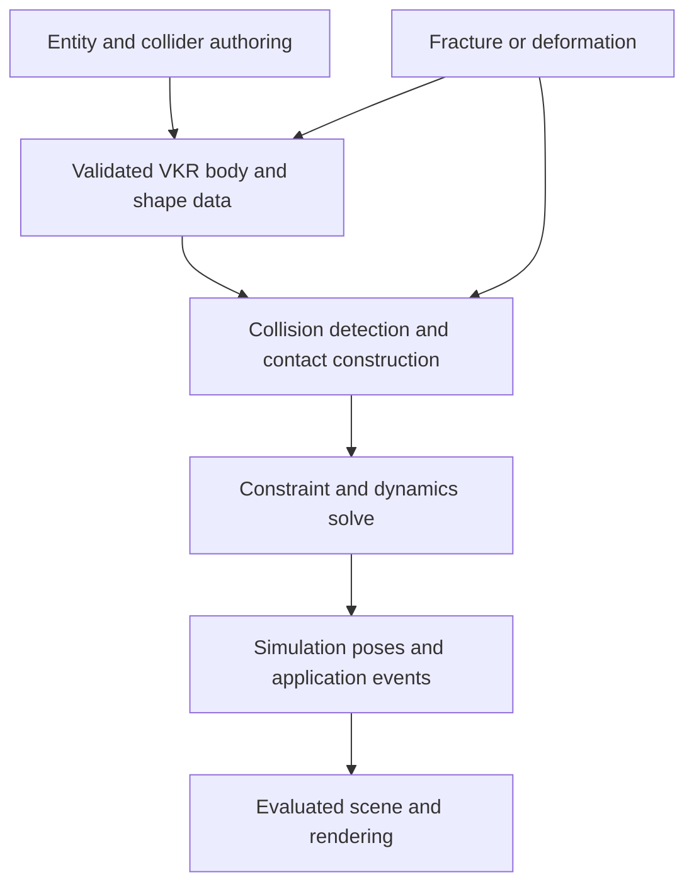

# Collision research and AVBD destructibles

## Scope and current baseline

[ADR-072](../adr/072-entity-collision-and-rigid-body-physics.md) owns the implemented
Jolt integration, primitive/cooked collider children, rigid-body response, sweeps,
contact callbacks, parented positive-scale bodies, bone attachments/ragdolls,
joints, named layers/matrix authoring and versioned persistence. This proposal
retains the engine/UI research and remaining AVBD/destruction work. Native
acceptance and performance evidence remain separate from implemented status.
No per-entity solver picker is proposed.

## Research: Unreal Engine 5, Godot and Unity

Research accessed 2026-09-13. Epic's opened pages identify UE 5.8; Godot's stable
index identifies the 4.7 branch; Unity references use the explicit Unity 6.0
documentation set (`6000.0`). These labels identify the consulted documentation,
not a claim that each is the newest installed engine. Findings come from official
documentation and published UI examples, not hands-on engine sessions.

| Engine | Object and collision structure | UI structure | Lesson for VKR |
|---|---|---|---|
| Unreal Engine 5 | Actors contain components. Scene components have attachment transforms; primitive components include collision boxes, capsules and meshes. Static mesh assets may contain several simple collision shapes. Skeletal physics assets contain bodies and constraints. | Actor/component selection leads to Details. Collision presets group participation and response settings. Static Mesh Editor fits shapes. Physics Asset Editor adds a skeleton tree, constraint graph and simulation preview. | Separate object, shape and body identity. Offer presets and a focused skeletal tool only when needed. |
| Godot | A `PhysicsBody3D` or `Area3D` owns direct `CollisionShape3D` children, each referring to a `Shape3D` resource. Multiple shapes belong to the same body. | Scene tree selects the body or shape node; Inspector selects a shape resource and edits dimensions. Viewport handles fit it to the visible mesh. | Closest match to the proposed child-entity authoring model. Make ownership visible. |
| Unity | A GameObject has collider and optional Rigidbody components. One Rigidbody with colliders on that object or child GameObjects forms a compound body. | Hierarchy selects objects; Inspector separates Rigidbody and collider settings. `Edit Collider` enables Scene handles. Physics settings and Physics Debugger provide broader inspection. | Combine independent child transforms with one body's motion and mass properties. |

Sources: [Epic components](https://dev.epicgames.com/documentation/en-us/unreal-engine/components-in-unreal-engine),
[Epic static mesh collision](https://dev.epicgames.com/documentation/en-us/unreal-engine/setting-up-collisions-with-static-meshes-in-unreal-engine),
[Godot collision shapes](https://docs.godotengine.org/en/stable/tutorials/physics/collision_shapes_3d.html),
[Unity compound colliders](https://docs.unity3d.com/6000.0/Documentation/Manual/compound-colliders-introduction.html).

### Unreal: presets and a separate skeletal workspace

The Collision section separates query/simulation participation from response rules.
Its documented presets expose object type and Ignore/Overlap/Block responses,
including trace responses. Both participants' responses affect the outcome. This
is richer than a single collision checkbox; VKR can start with named layers and a
pair matrix without copying the entire channel system.
[Collision response reference and Inspector image](https://dev.epicgames.com/documentation/en-us/unreal-engine/collision-response-reference-in-unreal-engine).

The Static Mesh Editor's Collision menu adds primitives or generated convex
approximations. Each simple shape can be selected, transformed and duplicated.
Triangle-mesh collision is a separate complexity choice; using complex collision
as simple does not make that object eligible for dynamic simulation.
[Static mesh authoring](https://dev.epicgames.com/documentation/en-us/unreal-engine/setting-up-collisions-with-static-meshes-in-unreal-engine),
[simple versus complex collision](https://dev.epicgames.com/documentation/en-us/unreal-engine/simple-versus-complex-collision-in-unreal-engine).

The published Physics Asset Editor image places the skeleton tree and constraint
graph on the left, the character and fitted body volumes in the center, and
Details plus generation/profile tools on the right. The toolbar includes animation
preview, collision controls and simulation testing. This is useful precedent for
later ragdoll authoring; the first VKR milestone can use its existing Scene panels.
[Physics Asset Editor interface and screenshot](https://dev.epicgames.com/documentation/en-us/unreal-engine/physics-asset-editor-interface-in-unreal-engine).

### Godot: shape nodes and explicit body roles

Only direct shape children contribute to a Godot collision body; shapes deeper
under arbitrary grouping nodes are ignored. Shapes on the same body do not collide
with one another. Its tutorial shows selecting `CollisionShape3D`, creating a
`BoxShape3D` in Inspector, and editing numeric dimensions or orange viewport
handles. An unconfigured shape shows a warning.
[Shape ownership](https://docs.godotengine.org/en/stable/tutorials/physics/collision_shapes_3d.html),
[authoring UI screenshots](https://docs.godotengine.org/en/stable/getting_started/first_3d_game/01.game_setup.html).

`RigidBody3D` exposes mass, gravity scale, damping, center of mass, inertia,
sleeping, CCD and freeze controls. Repeated transform writes, including inherited
movement from a moving ancestor, can interfere with dynamic simulation. Shape
`disabled`, body freeze, and `Debug > Visible Collision Shapes` have different
effects; runtime shape-disable changes should be deferred.
[RigidBody3D](https://docs.godotengine.org/en/stable/classes/class_rigidbody3d.html),
[CollisionShape3D](https://docs.godotengine.org/en/stable/classes/class_collisionshape3d.html).

Layers and masks belong to collision objects. `Area3D` supports object-level and
shape-level enter/exit signals. A `BoneAttachment3D` can follow a bone; a physical
skeleton instead introduces physical bone bodies and joints. This supports two
distinct VKR features: animated hitbox attachments and later ragdoll simulation.
[Layers and masks](https://docs.godotengine.org/en/stable/classes/class_collisionobject3d.html),
[Area3D](https://docs.godotengine.org/en/stable/classes/class_area3d.html),
[bone attachments](https://docs.godotengine.org/en/stable/classes/class_boneattachment3d.html),
[ragdoll authoring](https://docs.godotengine.org/en/stable/tutorials/physics/ragdoll_system.html).

### Unity: component Inspectors and physics diagnostics

The Rigidbody Inspector separates mass, damping, automatic mass properties,
gravity, kinematic mode, interpolation, detection mode and constraints. A Box
Collider has its own enable checkbox, center/size, material, trigger setting and
`Edit Collider` handles. Changing a compound's child shapes can alter automatic
mass properties. A collider resolves its associated Rigidbody on its own object
or a parent.
[Rigidbody Inspector](https://docs.unity3d.com/6000.0/Documentation/Manual/class-Rigidbody.html),
[Box Collider Inspector](https://docs.unity3d.com/6000.0/Documentation/Manual/class-BoxCollider.html),
[enable control](https://docs.unity3d.com/6000.0/Documentation/ScriptReference/Collider-enabled.html),
[body association](https://docs.unity3d.com/6000.0/Documentation/ScriptReference/Collider-attachedRigidbody.html).

Project Physics settings expose a layer collision matrix. Physics Debugger has
Info, Filtering, Rendering, Contacts and Queries tabs, including body state and
collision-geometry selection. This is a useful progression for VKR: selected
shape overlays first, filtered world diagnostics as their concrete consumers ship.
[Layer UI](https://docs.unity3d.com/6000.0/Documentation/Manual/LayerBasedCollision.html),
[Physics Debugger](https://docs.unity3d.com/6000.0/Documentation/Manual/PhysicsDebugVisualization.html).

Unity's Ragdoll Wizard creates colliders, rigidbodies and joints from selected
character transforms. Dynamic triangle-mesh colliders have restrictions, and
rebuilding mesh collision for changing geometry has a cost. Primitive compounds
are therefore a sensible initial VKR representation for moving objects.
[Ragdoll Wizard](https://docs.unity3d.com/6000.0/Documentation/Manual/wizard-RagdollWizard.html),
[mesh collider limits](https://docs.unity3d.com/6000.0/Documentation/Manual/mesh-colliders-introduction.html).

## Remaining collision and animation work

Dynamic concave or deforming collision needs a separate topology/update policy.
The current convex cooker requires static proxies and rejects hulls exceeding its
vertex bound. Rotational weapon sweeps and character-controller movement need
their own contracts; a translational shape cast does not establish either.

Ragdoll authoring supplies bodies, constraints and solved-bone publication. Active
ragdoll motors, weighted animation/physics blending, recovery poses and root-motion
handoff remain future controller work. Bone attachment frames use evaluated global
node poses before inverse-bind multiplication, as specified in ADR-072.

The projected debug overlay has a 512-line cap. Larger inspection workloads or
depth-tested rendering need measured justification and bilateral shader evidence
if native contracts change. SDK/adapter allocations remain outside VKR tag totals;
complete physics-memory reporting needs explicit accounting.

## AVBD and destructible entities

**A later AVBD implementation need not rewrite collider authoring, but can require
substantial physics-runtime replacement.** AVBD is a method for solving dynamics
with contact and other constraints. The authors demonstrate rigid stacking,
friction, articulated bodies and interactions with soft bodies; it is not confined
to destructible objects. Fracture geometry and the rules for breaking an object
are additional systems. [AVBD project and paper](https://graphics.cs.utah.edu/research/projects/avbd/).

This is a responsibility diagram, not a claim that Jolt exposes each box as a
replaceable public plug-in. Keeping the scene-facing boundary independent protects
authoring and consumers. It does not expose Jolt's internal manifolds, island
management or contact solver as VKR-owned interfaces.

| Part | Expected migration impact |
|---|---|
| Collider children, body identity, shape dimensions, saved scene data and editor controls | Retain. Add explicitly versioned features only where AVBD/destruction needs new authored data. |
| Layers, query meaning, materials, motion modes and event identities | Retain their public meaning; implement and test equivalent behavior. Numerical outcomes may differ. |
| Primitive/convex geometry and cooked source descriptions | Often reusable. Regenerate implementation-specific acceleration data or serialized library blobs. |
| Broad phase, narrow phase and CCD | Algorithms can be reused if suitable, but Jolt's internal path is not automatically available as a standalone pipeline. GPU AVBD or deforming geometry may require different storage and detection. |
| Persistent contacts, friction state, constraint assembly, coloring/islands and warm starts | Solver-dependent work. Expect adaptation or replacement, with new correctness evidence. |
| Solver step, sleep/wake and pose publication | Reimplement behind the VKR boundary; explicitly preserve or revise externally visible semantics. |
| Fracture topology, chunk geometry, bonds and mass transfer | New destruction work regardless of solver. |

For **pre-fractured rigid chunks**, a destruction asset can describe immutable
chunk shapes and breakable bonds. Breaking activates/removes bodies and constraints,
updates broad-phase proxies, invalidates changed contact mappings and transfers
mass/inertia and motion. A released chunk's velocity includes the parent's angular
contribution at its center of mass. Preserve total mass and account for momentum;
do not give every chunk the original body's mass or zero velocity. Stable chunk
IDs map impacts and selection back to the destructible owner. Rigid-body physics
can support this without AVBD.

For **deformation or fracture that creates geometry at runtime**, collision must
support changed surfaces/topology, acceleration updates, newly exposed contacts,
possibly self-collision and mass recomputation. This extends more than the solver.
Do not promise this through a `destructible` checkbox on a static collision mesh.

Avoid assigning ordinary interacting bodies to Jolt and destructibles to AVBD
without a coupling design. If both systems move each other, the contact solve must
exchange forces/motion consistently or share a coupled solve. Treating the other
world as kinematic gives one-way interaction, which does not satisfy two-way
stacking. Splitting unrelated simulation islands is different, but ownership must
change when those islands contact.

Recommended path: retain the accepted VKR world boundary; evaluate AVBD in a small
independent 3D prototype when that work is selected; then prefer replacing the
interacting world implementation over running two loosely coupled worlds. Do not
fork Jolt's contact solver as the default migration plan. If AVBD becomes an
immediate requirement, perform that feasibility prototype before extending the
Jolt adapter with destruction-specific contracts. No per-entity solver picker is proposed.

A GPU AVBD path would additionally need explicit simulation-to-render dependencies,
CPU query/event availability, bounded transfer latency and portable Metal/Vulkan
implementation. A Metal-only demonstration would not establish VKR compatibility
or make GPU readback acceptable in the frame loop.

## Acceptance for future work

Before implementation, select one extension and resolve its ownership, saved-data
and query/event semantics. Use isolated deterministic fixtures for mathematical,
contact, identity and capacity defects. All scene-based runtime, visual and timing
acceptance uses Bistro; add a scoped Bistro case when no compatible case exists.

Bone work must verify evaluated-pose attachment, culling independence, seeking,
reset and fast-motion behavior. New shapes must verify cooking compatibility,
transform restrictions, mass/inertia and loaded-resource lifetime. Solver or
fracture work must verify contact response, stacking, momentum transfer, query/
event equivalence and failure recovery. A two-way coupling design is required if
two solvers can affect the same interacting objects.

Timing claims require matched, capture-free normal Release measurements with
equivalent work/output, graphics validation variables unset, valid samples and
spread. Report step cost, catch-up debt, active/sleeping bodies, contact/event work,
memory and debug-display cost separately. Native editor appearance and shader
parity require their own checks; CPU tests and library benchmarks do not establish
those claims. Move accepted implementation decisions into the owning ADR and
narrow this proposal again as extensions ship.
